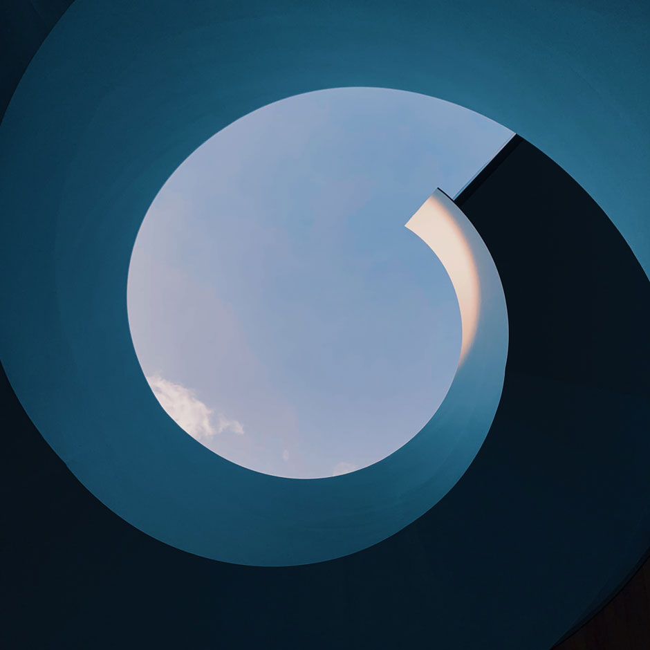
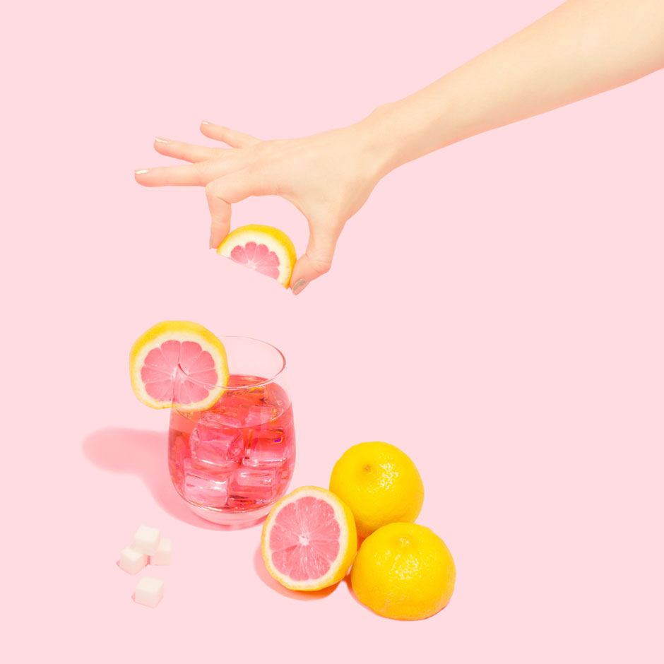

# KiwiMI
I'm <3 Modal Images

## Live version
[Test page](https://chetverolis.github.io/KiwiMI_old/)

## Quick Start
Just follow these steps, it's easy :)

1. Paste it in the head of your site
```html
<meta name="viewport" content="width=device-width, initial-scale=1.0, maximum-scale=1.0, minimum-scale=1.0, user-scalable=no, target-densityDpi=device-dpi" />
<script type="text/javascript" src="https://code.jquery.com/jquery-3.4.1.min.js"></script>
<script type="text/javascript" src="js/KiwiMI.js"></script>
```

2. Copy the html block to the end of the page, before closing the body tag
```html
<span id="closeModal"></span>
<span id="previousImg"></span>
<span id="nextImg"></span>
<div id="modalWindow">
  <span id="topIndent"></span>
  <span id="leftIndent"></span>
    <span id="imgSpace">
      
    </span>
  <span id="rightIndent"></span>
  <span id="imgDescription">Test description</span>
  <span id="closingArea" style="display: none;">Pull down to close</span>
  <span id="space" style="display: none;" </span>
</div>
```

3. Сopy this css and paste at the end of your style
```css
#modalWindow {
  display: none;
  height: 100%;
  width: 100%;
  position: fixed;
  overflow-y: auto;
  overflow-x: hidden;
  left: 0;
  top: 0;
  background-color: rgb(0,0,0);
  scroll-snap-type: y proximity;
  z-index: 997;
}

@supports (backdrop-filter: none) {
  #modalWindow {
    backdrop-filter: blur(10px);
  }
}

#topIndent {
  display: block;
  height: 80px;
  width: 100%;
}

#closeModal {
  display: none;
  position: fixed;
  height: 80px;
  width: 100%;
  top: 0;
  margin-left: -4px;
  background-image: url('img/close.png');
  background-size: contain;
  background-repeat: no-repeat;
  background-position: center right;
  opacity: 1;
  -webkit-transition: opacity 0.2s ease-in-out;
  -moz-transition: opacity 0.2s ease-in-out;
  -o-transition: opacity 0.2s ease-in-out;
  -ms-transition: opacity 0.2s ease-in-out;
  transition: opacity 0.2s ease-in-out;
  z-index: 998;
}

#closeModal:hover {
  opacity: 0.5;
}

#leftIndent {
  display: inline-block;
  height: calc((var(--vh, 1vh) * 100) - 160px);
  width: 80px;
}

#previousImg {
  display: none;
  position: fixed;
  height: calc((var(--vh, 1vh) * 100) - 160px);
  width: 80px;
  top: 80px;
  left: 0;
  background-image: url('img/leftarrow.png');
  background-size: contain;
  background-repeat: no-repeat;
  background-position: center center;
  opacity: 1;
  -webkit-transition: opacity 0.2s ease-in-out;
  -moz-transition: opacity 0.2s ease-in-out;
  -o-transition: opacity 0.2s ease-in-out;
  -ms-transition: opacity 0.2s ease-in-out;
  transition: opacity 0.2s ease-in-out;
  z-index: 998;
}

#previousImg:hover {
  opacity: 0.5;
}

#imgSpace {
  width: calc(100vw - 160px);
  height: calc(100vh - 160px);
  display: inline-table;
  margin-left: -4px;
}

#imgPlace {
  display: inline-table;
  width: calc(100vw - 160px);
  height: calc(100vh - 160px);
  margin-left: -4px;
}

#rightIndent {
  display: inline-block;
  height: calc((var(--vh, 1vh) * 100) - 160px);
  width: 80px;
  margin-left: -4px;
}

#nextImg {
  display: none;
  position: fixed;
  height: calc((var(--vh, 1vh) * 100) - 160px);
  width: 80px;
  top: 80px;
  right: 0;
  margin-left: -4px;
  background-image: url('img/rightarrow.png');
  background-size: contain;
  background-repeat: no-repeat;
  background-position: center center;
  opacity: 1;
  -webkit-transition: opacity 0.2s ease-in-out;
  -moz-transition: opacity 0.2s ease-in-out;
  -o-transition: opacity 0.2s ease-in-out;
  -ms-transition: opacity 0.2s ease-in-out;
  transition: opacity 0.2s ease-in-out;
  z-index: 998;
}

#nextImg:hover {
  opacity: 0.5;
}

#imgDescription {
  display: block;
  width: 100%;
  height: 200px;
  line-height: 200px;
  text-align: center;
  font-family: sans-serif;
  font-size: 1.2em;
  color: #4c4c4c;
  margin-top: -4px;
}

#closingArea {
  width: 100%;
  height: 50px;
  line-height: 50px;
  text-align: center;
  font-family: sans-serif;
  font-size: 1.2em;
  color: #4c4c4c;
  background: #ffffff0d;
}

#space {
  width: 100%;
  height: 300px;
  background-color: #ffffff0d;
}
```

4. Needs to download files and copy them to the root of the site
<br>[Download](https://fourxone.github.io/KiwiMI/KiwiMI_beta.zip)

5. Add id="modalImg" and dataIndex="0" (then 1,2,... etc.) attribute to your img tag
```html


```

## License and price.
KiwiMI is licensed under the terms of the MIT License.

## About.
This project made by Skvortsov Nikita Dmitrievich
